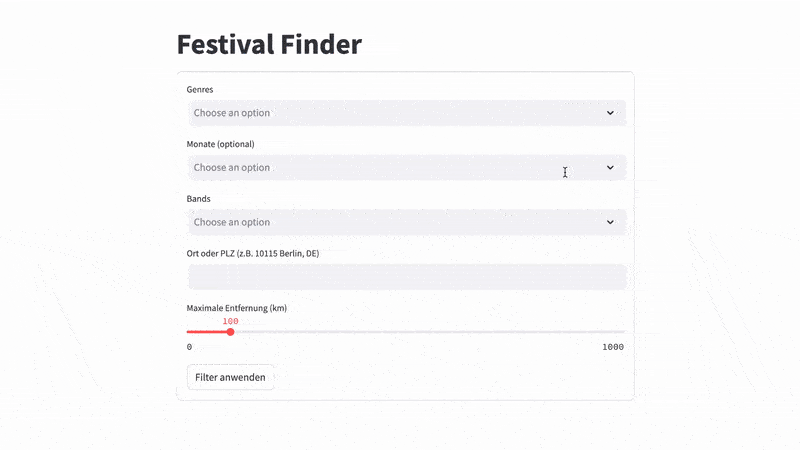

# Festival Finder

[Festival Finder](https://saschaniemann.com/festival-finder) is a web application designed to help users discover music festivals in Germany and the surrounding area. Whether you're a fan of rock, pop, electronic, or indie music, this app makes it easy to find festivals that match your preferences.



## Features

- **Search Festivals**: Find festivals by location, date, or genre.
- **Sort Festivals**: Sort the found festivals by name, date or distance
- **Festivals on map**: Show the festivals on a map
- **Festival Details**: View detailed information about each festival, including lineup, venue, and links to its official website.

## Installation

1. Clone the repository:
    ```bash
    git clone https://github.com/saschaniemann/festival-finder.git
    ```
2. Navigate to the project directory:
    ```bash
    cd festival-finder
    ```
3. Install dependencies:
    ```bash
    pip install -r requirements.txt
    ```

## Usage
You can either use docker or run it natively:
### Docker
1. Build the Docker image:
    ```bash
    docker build -f deployment/Dockerfile -t festival-finder .
    ```
2. Run the crawler (this might take a couple of hours due to API limitations):
    ```bash
    docker run -v $(pwd)/data:/app/data festival-finder python scripts/crawler.py
    ```
3. Start the application:
    ```bash
    ./deployment/start_container.sh
    ```
4. Open the application in your browser at `http://localhost:8501`.
5. Use the filters to search for festivals by location, genre, date, or bands.
6. View festival details or explore the map for nearby events.

### Native
1. Run the crawler. This might take a couple of hours (mostly limited by Gemini's and Geoapify's API limitations of the free tier):
    ```bash
    python scripts/crawler.py
    ```
2. Start the application:
    ```bash
    streamlit run scripts/app.py
    ```
3. Open the application in your browser (usually at `http://localhost:8501`).
4. Use the filters to search for festivals by location, genre, date, or bands.
5. View festival details or explore the map for nearby events.

## Technologies Used

- **Frontend**: Streamlit
- **Backend**: Python
- **APIs**: Geoapify (geocoding), Gemini API (lineup extraction)

## Data Sources

- [Festivalticker](https://www.festivalticker.de): Festival information
- The festivals' official web pages as linked at Festivalticker
- [Geoapify](https://www.geoapify.com): Geocoding API
- [Gemini API](https://developers.google.com/): Lineup extraction

## License

This project is licensed under the [MIT License](LICENSE).

## Contact

For questions or feedback, feel free to reach out.

Enjoy discovering your next festival adventure with Festival Finder!
